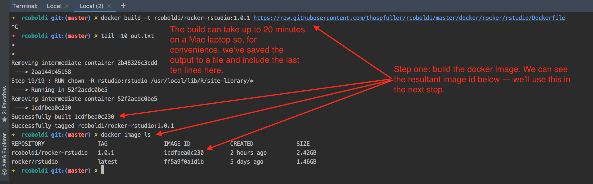
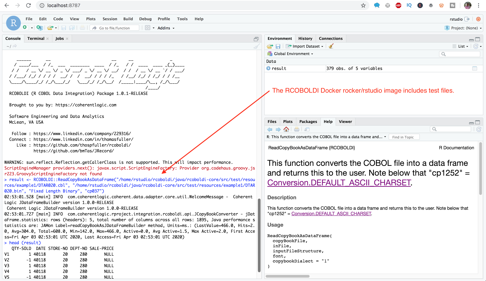

# R COBOL DI (Data Integration) Package: An R package for importing COBOL CopyBook data into the R Project as data frames.

[](http://www.gnu.org/licenses/lgpl-3.0.html) [](https://www.linkedin.com/in/thomasfuller/) [](https://twitter.com/ThosPFuller) [](https://github.com/thospfuller) [](http://eepurl.com/b5jPPj) [](https://coherentlogic.com?utm_source=rcoboldi_on_gh)  [](https://www.meetup.com/Washington-DC-CTO-Meetup-Group/)

The RCOBOLDI Package is an R package that facilitates the importation of COBOL CopyBook data directly into the R Project for Statistical Computing as properly structured data frames.

Note that not all copybook files can be converted into CSV -- for example single-record type files can be converted to CSV however complicated multi-record type files will NOT map to CSV.

# R COBOL Data Integration (RCOBOLDI) package examples

## [Example One: Install the RCOBOLDI package locally and then convert COBOL data files into data frames.](SIMPLE_EXAMPLE.md)

In this simple example the R COBOL Data Integration package has been installed locally and several data files are converted into data frames using the ReadCopyBookAsDataFrame function; the CobolToCSV function is also demonstrated.

This example also how includes a call to ```CobolToCSV```.

### R COBOL Data Integration (RCOBOLDI) package preconditions

The following should be executed prior to attempting to run the R script, below.

- [R version 3.6.3](https://cran.r-project.org/bin/)
- Java 11
- install.packages(c("drat", "RJSONIO", "rJava"))

If you have trouble with rJava and Java 11 then you might need to execute the following:

```R CMD javareconf```

### R COBOL Data Integration (RCOBOLDI) package example

The following example should work with the only change needed being the path to the files.

Test files can be found [here](java/rcoboldi-core/src/test/resources).

```
library(drat)

drat::addRepo("thospfuller")

# The following should work for Mac OSX (El Capitan) and on Linux.
install.packages("RCOBOLDI")

# Or install via source (for Windows users, specifically).
install.packages("RCOBOLDI", type = "source")

library("RCOBOLDI")
RCOBOLDI::Initialize()

#
# Substitute the directory path below with one which points to the test files being used.
# 
# The test files below can be found here:
# 
# https://github.com/thospfuller/rcoboldi/tree/master/java/rcoboldi-core/src/test/resources 
#
result <- RCOBOLDI::ReadCopyBookAsDataFrame(".../rcoboldi/java/rcoboldi-core/src/test/resources/example1/DTAR020.cbl", "/Users/thospfuller/development/projects/rcoboldi/java/rcoboldi-core/src/test/resources/example1/DTAR020.bin", "Fixed Length Binary", "cp037")
head(result)
result <- RCOBOLDI::ReadCopyBookAsDataFrame(".../rcoboldi/java/rcoboldi-core/src/test/resources/example2/DTAR107.cbl", "/Users/thospfuller/development/projects/rcoboldi/java/rcoboldi-core/src/test/resources/example2/DTAR107.bin", "Fixed Length Binary", "cp037")
head(result)
result <- RCOBOLDI::ReadCopyBookAsDataFrame(".../rcoboldi/java/rcoboldi-core/src/test/resources/example3/AmsLocation.cbl", "/Users/thospfuller/development/projects/rcoboldi/java/rcoboldi-core/src/test/resources/example3/Ams_LocDownload_20041228.txt", "Text", "cp1252")
cobrix_test1_result <- RCOBOLDI::ReadCopyBookAsDataFrame(".../rcoboldi-gh/rcoboldi/java/rcoboldi-core/src/test/resources/example4/absaoss_cobrix_test1_copybook.cob", "/Users/thospfuller/development/projects/rcoboldi-gh/rcoboldi/java/rcoboldi-core/src/test/resources/example4/absaoss_cobrix_test1_example.bin", "**TBD**", "**TBD**")
head(cobrix_test1_result)
result <- RCOBOLDI::ReadCopyBookAsDataFrame(".../rcoboldi-gh/rcoboldi/java/rcoboldi-core/src/test/resources/example4/absaoss_cobrix_test1_copybook.cob", "/Users/thospfuller/development/projects/rcoboldi-gh/rcoboldi/java/rcoboldi-core/src/test/resources/example4/absaoss_cobrix_test1_example.bin", "Fixed Length Binary", "cp037")

#
# The following line will convert the absaoss_cobrix_test1 data file into a CSV file.
#
RCOBOLDI::CobolToCSV("-I .../rcoboldi/java/rcoboldi-core/src/test/resources/example4/absaoss_cobrix_test1_example.bin -C .../rcoboldi/java/rcoboldi-core/src/test/resources/example4/absaoss_cobrix_test1_copybook.cob -FS Fixed_Length -IC cp037 -O .../temp/absaoss_cobrix_test1.csv")
```

### R COBOL Data Integration (RCOBOLDI) package example output

 Package in use.")

-----

## Try the R COBOL Data Integration package by creating a container from a preconfigured Rocker/RStudio Docker image available on DockerHub : If you just want to try the package on some test data, start here.

Below we include two examples for working with images in Docker along with a demonstration video showing the package in action.

### Using the R COBOL Data Integration (RCOBOLDI) package RStudio image on DockerHub

The RCOBOLDI [Rocker/RStudio image](https://hub.docker.com/r/thospfuller/rcoboldi-rocker-rstudio) is available on DockerHub. This image is built using dependencies which have been deployed in the [thospfuller/drat](https://github.com/thospfuller/drat) repository.

The RCOBOLDI [Rocker/Verse image](https://hub.docker.com/r/thospfuller/rcoboldi-rocker-verse) is a complete build using source code cloned from the GitHub project repository.

The following is a fully working example based on the Rocker/RStudio image.

#### Pull and run the R COBOL Data Integration (RCOBOLDI) DockerHub image from the command line

```docker pull thospfuller/rcoboldi-rockstar-rstudio:[latest or 1.0.3 or some other tag]```

then

```docker image ls```

should show something like this:

```
> REPOSITORY                            TAG                 IMAGE ID            CREATED             SIZE
> thospfuller/rcoboldi-rockstar-rstudio   1.0.3             3f8c1c269940        37 minutes ago      2.42GB
```

then

```docker run -d -p 8787:8787 -e PASSWORD=password --name rstudio -i -t 3f8c1c269940```

#### Try the R COBOL Data Integration (RCOBOLDI) package from the browser

The next  is to test this in R so point your browser to [http://localhost:8787](http://localhost:8787) and use "rstudio" and "password" to login and then execute the following:

```
library(RCOBOLDI)
RCOBOLDI::Initialize()
result <- RCOBOLDI::ReadCopyBookAsDataFrame("/home/rstudio/rcoboldi/java/rcoboldi-core/src/test/resources/example1/DTAR020.cbl", "/home/rstudio/rcoboldi/java/rcoboldi-core/src/test/resources/example1/DTAR020.bin", "Fixed Length Binary", "cp037")
head(result)
```

### Building the R COBOL Data Integration (RCOBOLDI) RStudio Docker Image Locally

#### Step 1.) Build the R COBOL Data Integration (RCOBOLDI) (this can take up to 20 minutes).

```
docker build -t rcoboldi/rocker-rstudio:1.0.1 https://raw.githubusercontent.com/thospfuller/rcoboldi/master/docker/rocker/rstudio/Dockerfile
[some image id]
```



#### Step 2.) Run the R COBOL Data Integration (RCOBOLDI) container based on the image created in the previous step

```
docker run -d -p 8787:8787 -e PASSWORD=password --name rstudio -i -t [some image id]
[some container id]
```

#### Step 3.) Browse to http://localhost:8787 and enter the username & password combination rstudio & password.

The next three steps appear in the video.

Steps 4-7.) From the R CLI execute:
```
#### Step 4.)
library(RCOBOLDI)

#### Step 5.)
RCOBOLDI::Initialize()

#### Step 6.)
result <- RCOBOLDI::ReadCopyBookAsDataFrame("DTAR020.cbl", "DTAR020.bin", "Fixed Length Binary", "cp037")

#### Step 7.)
head(result)
```



### YouTube

If you're looking to load COBOL data files into the R Project for Statistical Computing then you came to the right place.

The Dockerfile in this example is based on Rocker / RStudio and will be running locally on port 8787.

Below is a video which demonstrates the R COBOL Data Integration package running in Docker.

<a href="http://www.youtube.com/watch?feature=player_embedded&v=rBIrvUA788M" target="_blank"></a>

## See Also

- [Rocker/RStudio](https://hub.docker.com/r/rocker/rstudio/)
- [Rocker/Verse](https://hub.docker.com/r/rocker/verse/)

# R COBOL Data Integration (RCOBOLDI) package logging

The Java API uses Log4J and writes files to the ~/rcoboldi-package-logs/ directory. [The Log4J configuration file can be found here](java/rcoboldi-core/src/main/resources).

# See Also

- [JRecord: Read Cobol data files in Java on SourceForge](https://sourceforge.net/projects/jrecord/)
- [JRecord: Read Cobol data files in Java on GitHub](https://github.com/bmTas/JRecord)
- [AbsaOSS cobrix: A COBOL parser and Mainframe/EBCDIC data source for Apache Spark](https://github.com/AbsaOSS/cobrix)
- [(DataBricks) Cobrix: A Mainframe Data Source for Spark SQL and Streaming](https://databricks.com/session/cobrix-a-mainframe-data-source-for-spark-sql-and-streaming)
- [(YouTube) Cobrix: A Mainframe Data Source for Spark SQL and Streaming](https://www.youtube.com/watch?v=BOBIdGf3Tm0)
- [ProLeap ANTLR4-based parser for COBOL](https://github.com/uwol/proleap-cobol-parser)
- [zenaptix-lab / copybookStreams](https://github.com/zenaptix-lab/copybookStreams)
- [EBCDIC on Wikipedia](https://en.wikipedia.org/wiki/EBCDIC)
- [Cobol hits 50 and keeps counting](https://www.theguardian.com/technology/2009/apr/09/cobol-internet-programming)
- [ProLeap ANTLR4-based parser for COBOL](https://github.com/uwol/proleap-cobol-parser)
- [EBCDIC Character Format - A Guide](https://niallbunting.com/ebcdic/cobol/packing/copybooks/2019/12/09/ebcdic-character-format-guide.html)
- [PyPI EBCDIC](https://pypi.org/project/ebcdic/)
- [Brush up your COBOL: Why is a 60 year old language suddenly in demand?](https://stackoverflow.blog/2020/04/20/brush-up-your-cobol-why-is-a-60-year-old-language-suddenly-in-demand/)
- [COBOL Is Everywhere. Who Will Maintain It?](https://thenewstack.io/cobol-everywhere-will-maintain/)
